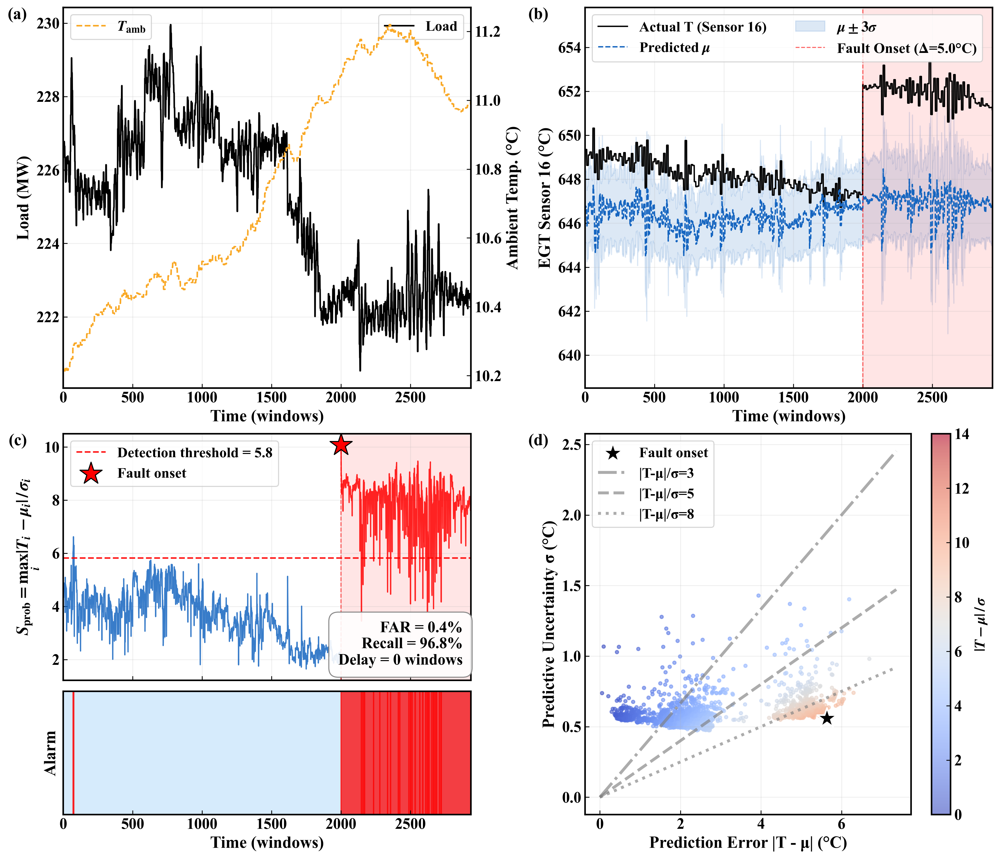

# PICG-VAE: Physics-Informed Circumferential Graph VAE

EGT anomaly warning in gas turbines is easily affected by operating-condition variations, which makes healthy transients difficult to distinguish from fault-induced deviations. To address this problem, this paper proposes a physics-informed circumferential graph VAE (PICG-VAE). The EGT anomaly detection task is formulated as probabilistic prediction of the circumferential exhaust temperature field conditioned on operating histories. PICG-VAE uses a causal temporal convolution encoder for operating dynamics, a circumferential graph representation for EGT spatial dependence, and a variational decoder for sensor-wise predictive mean and uncertainties. Two physics-informed losses are further introduced to constrain the learned healthy EGT distribution. Minimal reproduction package for **Fig. 4-3** (predictive uncertainty and standardized residual detection mechanism).

## Quick Start

```bash
pip install -r requirements.txt
python run.py
```

Output: `outputs/Fig4-3_sigma_mechanism.png`



*Fig. 4-3: The detection mechanism of PICG-VAE. (a) Load and ambient temperature drive EGT fluctuations. (b) A +5 degC drift on sensor 16 causes the true EGT to pierce the ±3σ predictive confidence band. (c) The standardized residual S_prob = max|T-μ|/σ stays low during healthy operation and spikes immediately at fault onset, crossing the detection threshold θ=5.82. (d) The |T-μ| vs σ scatter shows that fault points diverge from normal points — prediction error grows while uncertainty remains moderate, producing high S_prob values.*

## What This Reproduces

Four-panel figure demonstrating the core fault detection mechanism of PICG-VAE:


| Panel | Content                                       |
| ----- | --------------------------------------------- |
| (a)   | Load and ambient temperature context          |
| (b)   | True EGT, predicted μ, ±3σ confidence band |
| (c)   | Standardized residual S_prob + alarm bar      |
| (d)   |                                               |

**Fault scenario**: Single-sensor drift (Δ=5°C) on sensor 16, injected at t=2064 raw (window 2000).

**Detection**: S_prob = max_i |T_i - μ_i| / σ_i, threshold θ=5.82 (99th percentile on calibration set).

## Model Architecture

PICG-VAE predicts 31 exhaust gas temperature (EGT) sensors arranged circumferentially around a gas turbine. It takes two inputs:

- **C_seq**: Condition sequence (load, ambient temp, etc.) over the past 64 time steps
- **T_hist**: EGT history over the past 64 time steps

Three-stage architecture:

1. **TCN Encoder** — A temporal convolutional network processes the 7-dim condition sequence into a compact context vector `h_c` (64-dim), capturing how operating conditions evolve over time.
2. **Circumferential Graph Encoder** — A graph neural network processes the 31 EGT sensors arranged on a ring. Each sensor connects to its two neighbors (ring topology). A learnable adjacency matrix is added on top of the fixed ring graph, allowing the model to discover data-driven sensor interactions. Outputs a global graph embedding `h_g` (64-dim).
3. **Conditioned Graph Decoder** — The latent variable `z` (16-dim, sampled from a Gaussian parameterized by `[h_c, h_g]`) is concatenated with the condition context `h_c` and expanded to all 31 nodes. Combined with per-node positional embeddings, graph convolution layers decode this into per-sensor predictive mean `μ` and variance `σ²`.

**Key insight**: The model outputs both a prediction `μ` and an uncertainty `σ` per sensor. The standardized residual `|T - μ| / σ` naturally separates sensor noise (high σ, low score) from actual faults (low σ, high score). A single scalar threshold on `max_i |T_i - μ_i| / σ_i` achieves fault detection without per-sensor tuning.

## Files


| File           | Purpose                                                       |
| -------------- | ------------------------------------------------------------- |
| `model.py`     | Self-contained PICGVAE model (TCN + Graph + VAE)              |
| `run.py`       | Standalone script: load data → inject fault → infer → plot |
| `data/`        | Data segment (3000 points), scalers                           |
| `checkpoints/` | Trained model weights (`ring_1.0.pt`)                         |
| `outputs/`     | Generated figure                                              |

## Requirements

- Python 3.8+
- PyTorch, NumPy, Matplotlib, SciPy

## Citation

Part of the PICG-VAE paper. See the full repository for details.
